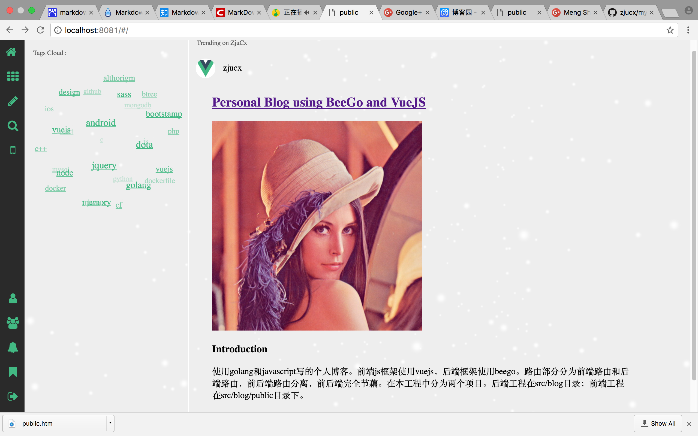
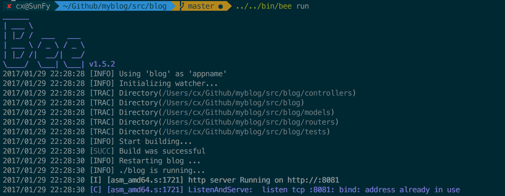

Personal Blog using BeeGo and VueJS
=========================
[](http://120.27.39.169:8080/home)
[](http://120.27.39.169:8080/home)

### Introduction
```
使用golang和javascript写的个人博客。前端js框架使用vuejs，后端框架使用beego。路由部分分为前端路由和后端路由，前后端路由分离，前后端完全节藕。在本工程中分为两个项目。后端工程在src/blog目录；前端工程在src/blog/public目录下。
```
### Requirements
```
1. Docker(1.1x)
2. Golang(1.6)
3. VUE 2.0
4. Vuex
5. Webpack
```

### Using
```
1)git clone project
  git clone https://github.com/zjucx/myblog.git
2)for golang project
  cd myblog/src/blog
  go get
3)for vuejs project
  cd myblog/src/blog/public
  npm install
4)put your vuejs project to beego progect
  npm run build
  cp -r dist/* ../views/dist
5)run your blog
  cd .. && bee run
```

### To Do List
- user management and property management etc
- generating tags for article automatically using TF-IDF algorithm
- web client for distribute scrawler
- web client for search engine

### Update
```
git pull
```

### Demo show

#### [Front-End](src/blog/public/README.md)

#### [Back-End](src/blog/README.md)


### Discussing
- [submit issue](https://github.com/zjucx/myblog/issues/new)
- email: 862575451@qq.com
