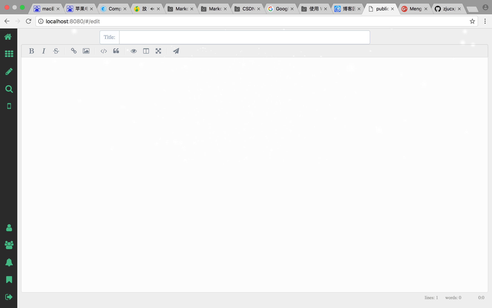

Personal Blog using BeeGo and VueJS（一）
=========================
### Introduction
```
个人博客的后台beego框架，采用mvc架构。抛弃beego自带的v层，使用public目录下的vuejs工程。目录结构如下:
├── conf
│   └── app.conf   ------配置部分，数据库等信息的配置
├── controllers    
│   ├── article.go ------文章操作请求处理部分，自动提取summary、安全性检查等部分
│   └── default.go
├── main.go
├── models         ------定义了数据库模型，用于与数据库交互
│   └── models.go
├── static         ------博客的静态资源目录
│   ├── css
│   ├── ico
│   ├── img
│   └── js
└── views          ------vuejs工程npm run build后的存放目录，view层
    ├── index.html ------博客主页
    └── index.tpl  ------废弃，没有使用tpl模版
```
### Requirements
```
1. Docker(1.1x)   -------部署mongodb服务
2. Golang(1.6)    -------开发语言
3. Mongodb        -------持久化介质
```

### Using
```
1)beego安装
  参考链接: https://beego.me/
2)抛弃beego自带的view层，使用vuejs框架重写view层
  cd myblog/src/blog
  go get
3)运行beego框架
  cd .. && bee run
```

### Implement
#### 在main.go中配置blog的静态目录
```
beego.SetStaticPath("/public", "public")
beego.SetStaticPath("/dist", "views/dist")
```
#### 修改主页为index.html
```
func (c *MainController) Get() {
	c.TplName = "index.html"
}
```
#### 设计RESTFUL路由规则
```
beego.Router("article/saveArticle", &controllers.ArticleController{})
beego.Router("article/getArticle/:id", &controllers.ArticleController{}, "get:GetArticle")
beego.Router("article/getArticles", &controllers.ArticleController{}, "get:GetArticles")
```
#### 在对应的Controller中添加对应路由的控制逻辑
```
参考beego文档，处理对应路由的GET、PUT、POST等方法。
```
#### 设计model，持久化
```
与数据库交互，定义存储的字段等信息。
```
### Demo show


### Discussing
- [submit issue](https://github.com/zjucx/myblog/issues/new)
- email: 862575451@qq.com
